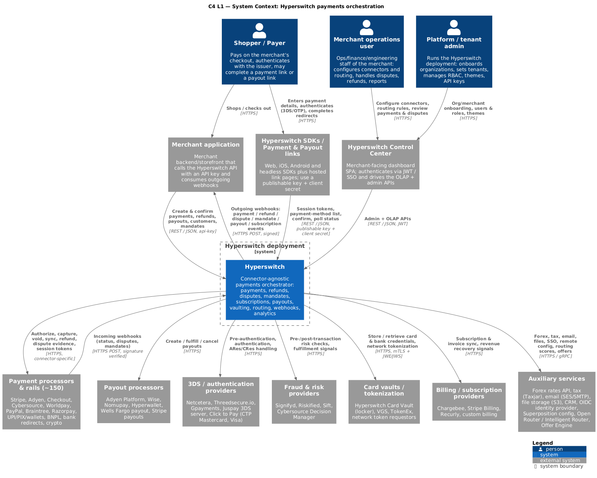
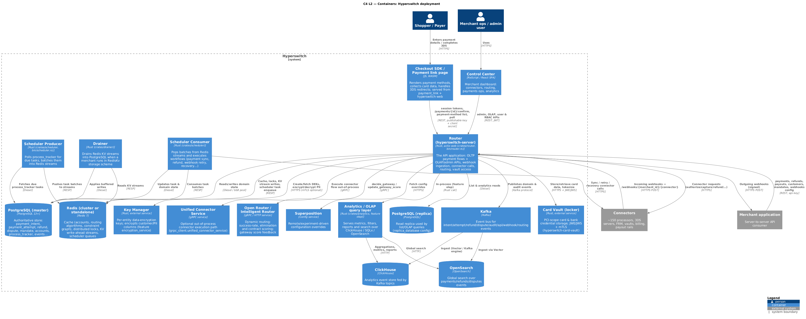
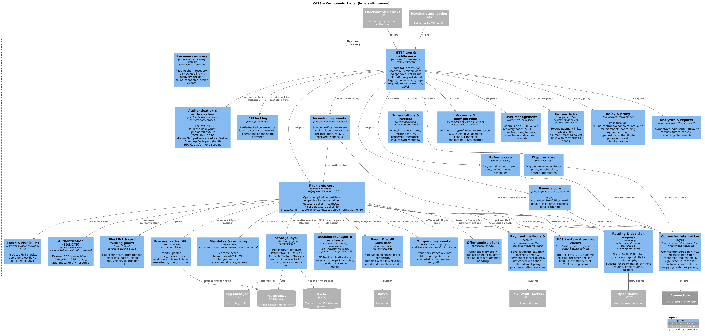
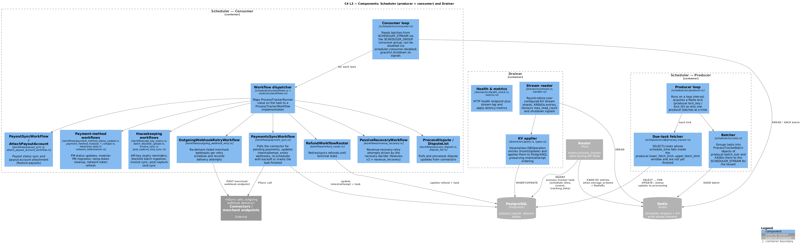
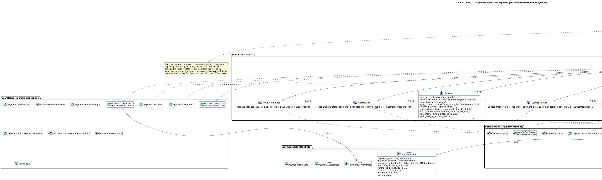

# 02 — System architecture (C4)

The architecture is documented with the [C4 model](https://c4model.com): four levels of
zoom (context → containers → components → code) plus dynamic and deployment views.
All diagrams are PlantUML scripts in [`diagrams/`](diagrams/) using the
[C4-PlantUML](https://github.com/plantuml-stdlib/C4-PlantUML) macro library vendored in
`diagrams/lib/`, and are rendered to `.png`/`.svg` next to the source.

Render everything with:

```bash
cd diagrams
java -jar plantuml.jar -tsvg *.puml     # PlantUML >= 1.2025.x required by C4-PlantUML
java -jar plantuml.jar -tpng *.puml
```

| C4 level | Diagram source | Rendered |
| --- | --- | --- |
| L1 System Context | [`c4-l1-system-context.puml`](diagrams/c4-l1-system-context.puml) | [PNG](diagrams/c4-l1-system-context.png) · [SVG](diagrams/c4-l1-system-context.svg) |
| L2 Containers | [`c4-l2-container.puml`](diagrams/c4-l2-container.puml) | [PNG](diagrams/c4-l2-container.png) · [SVG](diagrams/c4-l2-container.svg) |
| L3 Components — Router | [`c4-l3-component-router.puml`](diagrams/c4-l3-component-router.puml) | [PNG](diagrams/c4-l3-component-router.png) · [SVG](diagrams/c4-l3-component-router.svg) |
| L3 Components — Scheduler & Drainer | [`c4-l3-component-scheduler-drainer.puml`](diagrams/c4-l3-component-scheduler-drainer.puml) | [PNG](diagrams/c4-l3-component-scheduler-drainer.png) · [SVG](diagrams/c4-l3-component-scheduler-drainer.svg) |
| L4 Code — payment operation pipeline | [`c4-l4-code-payment-operation.puml`](diagrams/c4-l4-code-payment-operation.puml) | [PNG](diagrams/c4-l4-code-payment-operation.png) · [SVG](diagrams/c4-l4-code-payment-operation.svg) |
| Dynamic — card payment (create → confirm → 3DS → capture) | [`c4-dynamic-payment-confirm.puml`](diagrams/c4-dynamic-payment-confirm.puml) | [PNG](diagrams/c4-dynamic-payment-confirm.png) · [SVG](diagrams/c4-dynamic-payment-confirm.svg) |
| Dynamic — connector selection | [`c4-dynamic-routing-decision.puml`](diagrams/c4-dynamic-routing-decision.puml) | [PNG](diagrams/c4-dynamic-routing-decision.png) · [SVG](diagrams/c4-dynamic-routing-decision.svg) |
| Dynamic — incoming → outgoing webhook | [`c4-dynamic-incoming-webhook.puml`](diagrams/c4-dynamic-incoming-webhook.puml) | [PNG](diagrams/c4-dynamic-incoming-webhook.png) · [SVG](diagrams/c4-dynamic-incoming-webhook.svg) |
| Deployment — Docker Compose | [`c4-deployment-docker-compose.puml`](diagrams/c4-deployment-docker-compose.puml) | [PNG](diagrams/c4-deployment-docker-compose.png) · [SVG](diagrams/c4-deployment-docker-compose.svg) |

---

## L1 — System context



Hyperswitch sits between merchant-side software and the payment ecosystem:

* **Actors**: the shopper (checkout), the merchant's engineering team (API/dashboard),
  and merchant operations/finance staff (Control Center: refunds, disputes, reports).
* **Merchant-side systems**: the merchant backend (server-to-server API calls,
  webhook receiver), the checkout SDK / hosted payment links (client-side confirm with
  publishable key + `client_secret`), and the Control Center SPA.
* **Ecosystem**: ~150 connectors grouped by role — payment processors and wallets,
  payout rails, 3DS/authentication servers, fraud (FRM) providers, tax and billing
  providers, and the Hyperswitch Card Vault.
* Hyperswitch owns the payment record (intent/attempt), the routing decision, the
  stored payment methods (in the vault) and all merchant-facing eventing.

## L2 — Containers



Three deployable Rust binaries plus stateful backing services:

| Container | Binary / crate | Responsibility |
| --- | --- | --- |
| **Router** (`hyperswitch-server`) | `crates/router`, `crates/router/src/bin/router.rs` | The API application. OLTP payment flows, OLAP/admin APIs, webhook ingestion and delivery, connector calls, routing, vault access, dashboard/user APIs. Stateless and horizontally scalable. |
| **Scheduler — Producer** | `crates/router/src/bin/scheduler.rs` (+ `crates/scheduler`), `SCHEDULER_FLOW=producer` | Polls `process_tracker` for due tasks under a Redis lock and pushes batches into a Redis stream. |
| **Scheduler — Consumer** | same binary, `SCHEDULER_FLOW=consumer` | Reads batches and executes workflows (payment sync, refund sync, webhook retry, dispute processing, recovery, payout sync, …). |
| **Drainer** | `crates/drainer` (`drainer` binary) | Only in KV mode: drains Redis write-ahead streams into PostgreSQL. |
| PostgreSQL (master + replica) | — | Authoritative OLTP store; the Router reads analytics/list queries off the replica. |
| Redis | `crates/redis_interface` | Cache (accounts, routing algorithms, constraint graph), distributed API locks, KV write-ahead streams, scheduler streams, card-testing-guard counters. |
| Kafka | `crates/events` | Domain event fan-out (intent, attempt, refund, dispute, payout, audit, API, connector-API and outgoing-webhook logs). |
| ClickHouse | `crates/analytics` | OLAP store fed from Kafka; backs metrics/reports. |
| OpenSearch | `crates/analytics/src/opensearch.rs` | Global search over payments/refunds/disputes. |
| External Card Vault (locker) | separate repo | PCI-scoped card storage, reached over JWE/JWS. |
| Key manager / encryption service | `crates/common_utils` keymanager client | Envelope encryption of PII `[feature: encryption_service]`. |
| Unified Connector Service | gRPC, `crates/external_services` + `core/unified_connector_service` | Optional out-of-process connector execution. |
| Open Router | gRPC/HTTP | Optional external intelligent-routing/decision service. |

Why it is split this way: the Router must stay stateless and latency-bound, so anything
time-based (retries, syncs, dunning) is deferred to the process tracker and executed by
the scheduler; and anything write-amplifying (KV mode) is deferred to the drainer.

## L3 — Components

### Router



The Router is a layered actix-web application:

1. **HTTP app & middleware** (`routes/app.rs`, `middleware.rs`) — the v1/v2 route table,
   request-id/log-span setup, metrics, CORS, locale.
2. **Authentication & authorization** (`services/authentication.rs`, `core/user_role`) —
   API key, publishable key + client secret, JWT (dashboard) with RBAC, ephemeral keys,
   admin key, connector webhook auth, partial-auth headers.
3. **API locking** (`core/api_locking.rs`) — per-resource Redis locks that serialise
   concurrent confirm/capture calls on the same payment.
4. **Domain cores** (`core/*`) — payments, refunds, disputes, mandates, payouts,
   customers, payment methods, routing, webhooks, admin, users, blocklist, FRM,
   subscriptions, revenue recovery, relay, offers, analytics.
5. **Operation pipeline** (`core/payments/operations/`) — see L4 below.
6. **Decisioning** (`crates/euclid`, `crates/kgraph_utils`, `core/routing`,
   `core/conditional_config.rs`) — routing rules, eligibility graph, dynamic routing,
   3DS/surcharge decision manager.
7. **Connector layer** (`crates/hyperswitch_connectors` + `crates/hyperswitch_interfaces`) —
   `ConnectorIntegration<Flow, Req, Res>` implementations per connector.
8. **Storage layer** (`crates/storage_impl`, `router/src/db`) — repository traits over
   PostgreSQL and Redis KV, reverse lookups, caching, mock store for tests.
9. **Event layer** (`crates/events`, `router/src/events`) — Kafka/logging sinks for
   domain events, API logs, connector API logs, audit events.

### Scheduler & Drainer



* Producer: loop → Redis lock → fetch due `process_tracker` rows in the configured
  fetch window → batch (`ProcessTrackerBatch`) → `XADD` to the tenant's scheduler stream.
* Consumer: consumer-group read → deserialize batch → dispatch by
  `ProcessTrackerRunner` → workflow `execute_workflow`, then finish/retry/schedule-next.
* 17 runners exist (`crates/router/src/workflows/`), e.g. `PaymentsSyncWorkflow`,
  `RefundWorkflowRouter`, `OutgoingWebhookRetryWorkflow`, `ProcessDisputeWorkflow`,
  `PassiveRecoveryWorkflow`, `InvoiceSyncflow`, `NetworkTokenizationWorkflow`,
  `ApiKeyExpiryWorkflow`, `BatchBlocklistUpload`.
* Drainer: reads the KV streams written by the Router, applies the queued inserts/updates
  to PostgreSQL in order, and trims the stream — making Redis the write-ahead log for
  merchants on `MerchantStorageScheme::RedisKv`.

## L4 — Code



Every payment API verb is an `Operation` struct implementing five traits
(`ValidateRequest`, `GetTracker`, `Domain`, `UpdateTracker`, `PostUpdateTracker`), driven
by one orchestrator, `payments_operation_core`. Adding a capability means adding an
operation, not modifying the orchestrator. See
[04 — Payment lifecycle](04-payment-lifecycle.md).

## Cross-cutting architecture decisions

**API generations.** `v1` and `v2` are mutually exclusive cargo features that select
different Diesel schemas (`schema.rs` vs `schema_v2.rs`), domain models and route
tables. v1 is the stable generation; v2 introduces an explicit
organization → merchant → profile hierarchy in the URL space, `payment_intent`-first
APIs, and a redesigned payment-method/tokenization model.

**Storage scheme per merchant.** `MerchantStorageScheme::PostgresOnly` writes straight
to PostgreSQL. `RedisKv` writes the entity to Redis (hash + write-ahead stream entry)
and returns immediately; the Drainer replays the stream into PostgreSQL. Reverse-lookup
keys let the Router find KV entities by secondary ids.

**Multi-tenancy.** Tenants are configured (`[multitenancy.tenants.*]` in `config/*.toml`) with their own
schema, Redis key prefix and ClickHouse database; the Router resolves a tenant per
request and every scheduler stream is tenant-scoped.

**Caching & invalidation.** Merchant accounts, connector accounts, routing algorithms,
constraint graphs and configs are cached in-process and in Redis with a pub/sub
invalidation channel (`cache.rs`, `routes/cache.rs`).

**Idempotency & concurrency.** Client-supplied idempotency on payment ids, API locks in
Redis for confirm/capture, and idempotent webhook reconciliation keyed by connector
reference ids.

**Observability.** `router_env` sets up structured logs (per-request spans), OpenTelemetry
metrics and traces exported over OTLP; Kafka carries domain/API events to ClickHouse
for analytics.

See [10 — Deployment & operations](10-deployment-and-operations.md) for the runtime
topology and configuration layering.
