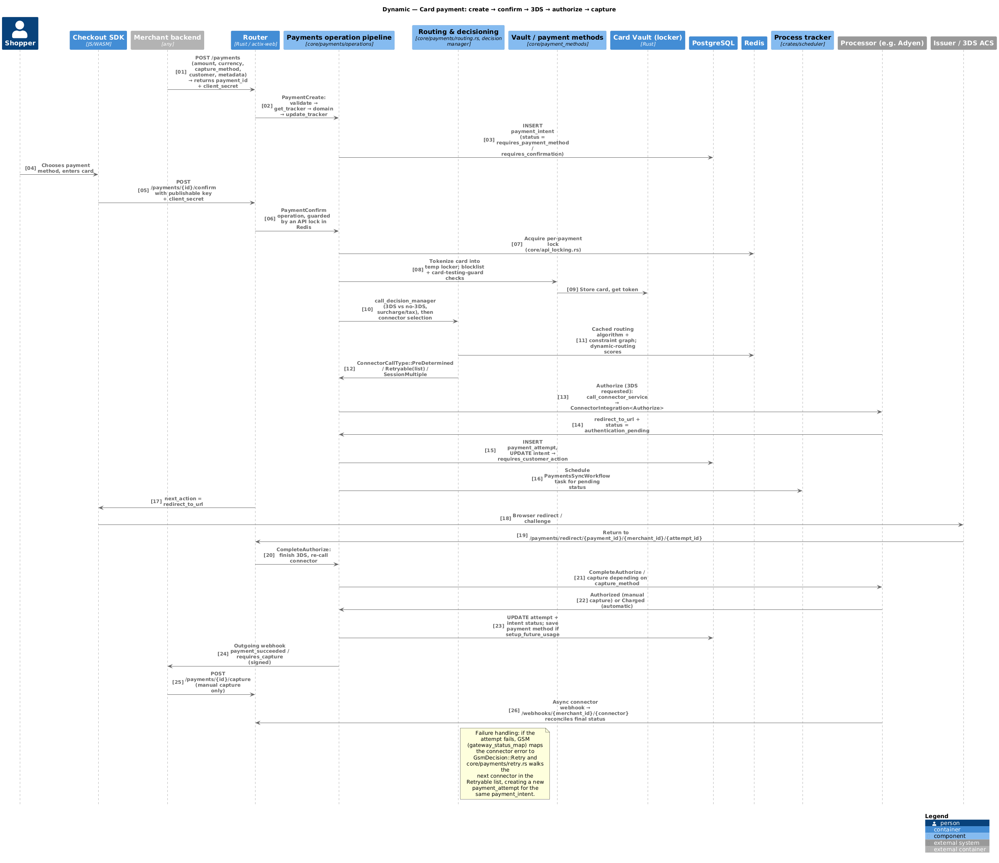

# 04 — Payment lifecycle

Code: `crates/router/src/core/payments.rs` (orchestrator),
`crates/router/src/core/payments/operations/` (one module per API verb),
`crates/router/src/core/payments/retry.rs`, `crates/router/src/workflows/`.

Diagrams: [payment confirm dynamic view](diagrams/c4-dynamic-payment-confirm.puml)
([PNG](diagrams/c4-dynamic-payment-confirm.png)) and
[L4 code view](diagrams/c4-l4-code-payment-operation.puml)
([PNG](diagrams/c4-l4-code-payment-operation.png)).



## The operation pipeline

`payments_operation_core::<F, Req, Op, FData, D>()` executes the same nine steps for every
payment verb:

1. `to_validate_request().validate_request()` — schema/business validation, resolves the
   merchant/profile context and the payment id.
2. `to_get_tracker().get_trackers()` — loads or creates `payment_intent` /
   `payment_attempt` and builds the operation's `Data` (`PaymentData` in v1,
   `PaymentConfirmData` / `PaymentStatusData` / `PaymentIntentData` in v2).
3. `to_domain()` — the domain hooks: customer resolution, payment-method tokenization
   (`make_pm_data`, vault/locker), blocklist and card-testing guard, decision manager
   (`run_decision_manager`), dynamic tax, external 3DS eligibility, and connector
   selection (`get_connector` / `perform_routing` → `ConnectorCallType`).
4. `to_update_tracker().update_trackers()` — persists pre-call state transitions.
5. `call_connector_service()` (or `call_multiple_connectors_service()` for wallet
   sessions) — builds `RouterData<Flow, Req, Res>` and runs the connector's
   `ConnectorIntegration` implementation.
6. `retry::do_gsm_actions()` — on failure, maps the connector error through
   `gateway_status_map` to a `GsmDecision`; `Retry` walks the next connector in the
   `ConnectorCallType::Retryable` list and creates a *new attempt* on the same intent
   `[feature: retry]`.
7. `to_post_update_tracker().update_tracker()` — `PaymentResponse` maps the connector
   response to `AttemptStatus` → `IntentStatus`, stores tokens/mandates, schedules
   follow-up tasks.
8. Domain events are emitted (Kafka + `events` table) and outgoing webhooks queued.
9. The response is assembled, including `next_action` for redirects/challenges.

Variants of the orchestrator exist for proxy and BYO-vault payments
(`proxy_for_payments_operation_core`, `external_vault_proxy_for_payments_operation_core`).

## Intent state machine

`IntentStatus` (`crates/common_enums/src/enums.rs`):

```
RequiresPaymentMethod ──confirm w/ PM──▶ RequiresConfirmation
        │                                     │
        │                                     ▼
        │                              (3DS / redirect)  RequiresCustomerAction
        │                                     │
        ▼                                     ▼
     Expired                              Processing ─────────────▶ Succeeded
                                              │  │                    ▲
                        (manual capture) ─────┘  └── Failed           │
                                RequiresCapture ──capture──▶ PartiallyCaptured
                                       │                     PartiallyCapturedAndCapturable
                                       │                     PartiallyCapturedAndProcessing
                                       ▼                     PartiallyAuthorizedAndRequiresCapture
                                   Cancelled / CancelledPostCapture
   RequiresMerchantAction (FRM / manual review) ──approve/reject──▶ Processing / Failed
   Conflicted / Review  (integrity or reconciliation mismatch)
```

Attempt-level state is finer-grained (`AttemptStatus`, 29 variants) and is what connector
responses map onto; the intent status is derived from the active attempt plus capture
accounting (`amount_captured`, `amount_capturable`).

## Flows in detail

### Create → confirm (single call or two calls)

* `POST /payments` (v1) / `POST /v2/payments` — `PaymentCreate` / `PaymentIntentCreate`.
  With `confirm=true` the create operation runs the whole confirm path in one call.
* `POST /payments/{id}/confirm` — `PaymentConfirm`. Guarded by an API lock in Redis so
  duplicate confirms cannot double-charge. Tokenizes card data into the locker,
  runs blocklist/card-testing checks, decision manager, routing, then authorization.

### 3DS / redirection

* If the decision manager or the merchant requests 3DS (`authentication_type = ThreeDs`,
  `force_3ds_challenge`, or a 3DS-decision-rule outcome), an authentication record is
  created and the connector (or authentication connector / Unified Authentication Service)
  returns a challenge.
* The response carries `next_action = redirect_to_url`; the browser goes to the ACS and
  returns to `/payments/redirect/{payment_id}/{merchant_id}/{attempt_id}`.
* The Router then runs `CompleteAuthorize` to finish authorization with the
  authentication result. Device-data-collection is represented by
  `AttemptStatus::DeviceDataCollectionPending`.

### Capture

* `CaptureMethod::Automatic` — capture happens as part of authorization; the terminal
  attempt status is `Charged`.
* `Manual` — authorization ends in `Authorized` / intent `RequiresCapture`;
  `POST /payments/{id}/capture` runs `PaymentCapture`.
* `ManualMultiple` — several partial captures, each a row in `captures`, with
  `multiple_capture_count` and the partially-captured intent statuses.
* `Scheduled` / `SequentialAutomatic` — delayed or chained capture behaviour.
* Overcapture and partial authorization are opt-in per profile/intent
  (`enable_overcapture`, `enable_partial_authorization`, `PartiallyAuthorized`).

### Void / cancel

`POST /payments/{id}/cancel` → `PaymentCancel` before capture; post-capture cancellation
where the processor supports it (`PaymentCancelPostCapture`, `CancelledPostCapture`,
`VoidedPostCharge`, plus a `PaymentsPostCaptureVoidSyncWorkflow` sync task).

### Sync

* On-demand: `GET /payments/{id}?force_sync=true` → `PaymentStatus` calls the connector's
  PSync flow.
* Scheduled: `PaymentsSyncWorkflow` tasks are inserted in `process_tracker` when an
  attempt ends in a pending state; the consumer re-syncs on the configured schedule until
  terminal or the retry budget is exhausted.

### Incremental & extended authorization

* `POST /payments/{id}/incremental_authorization` — raises the authorized amount, one row
  per increment in `incremental_authorization`, gated by
  `request_incremental_authorization` and connector support.
* Extended authorization prolongs an auth (`request_extended_authorization`,
  `extended_authorization_applied`, `capture_before`).

### Mandates / MIT

Setup with `setup_future_usage = OffSession` (or a zero-amount setup intent) stores a
mandate and/or `connector_mandate_detail` + `network_transaction_id`. Later MIT charges
use `PaymentRecurrence` with `off_session = true`; connector-agnostic MIT can be enabled
per profile (`is_connector_agnostic_mit_enabled`).

### Wallet sessions

`POST /payments/session_tokens` → `PaymentSession` with
`ConnectorCallType::SessionMultiple`: session objects are fetched from several connectors
in parallel and returned together for the SDK. `PaymentPostSessionTokens` /
`PaymentSessionUpdate` handle post-selection amount/tax updates.

### Failure handling and retries

* Connector errors are normalised to `unified_code` / `unified_message` (plus
  `issuer_error_code`/`issuer_error_message`).
* `gateway_status_map` maps (connector, flow, code, message) → `GsmDecision`.
* `Retry` creates a new `payment_attempt` on the same intent against the next connector
  from the routing result, bounded by profile settings (`is_auto_retries_enabled`,
  `max_auto_retries_enabled`); `is_manual_retry_enabled` allows merchant-triggered retries.
* Integrity checks compare the connector response against the request and surface
  `IntegrityFailure` / `Conflicted` rather than silently accepting a mismatch.

## What the merchant observes

* Synchronous API response with `status`, `next_action`, `client_secret`,
  `connector_transaction_id`.
* Outgoing webhooks for every meaningful transition (see
  [07 — Webhooks, events & scheduler](07-webhooks-events-and-scheduler.md)).
* Analytics/OLAP records for the intent, every attempt and the routing decision (see
  [01 §15](01-business-capabilities.md)).
