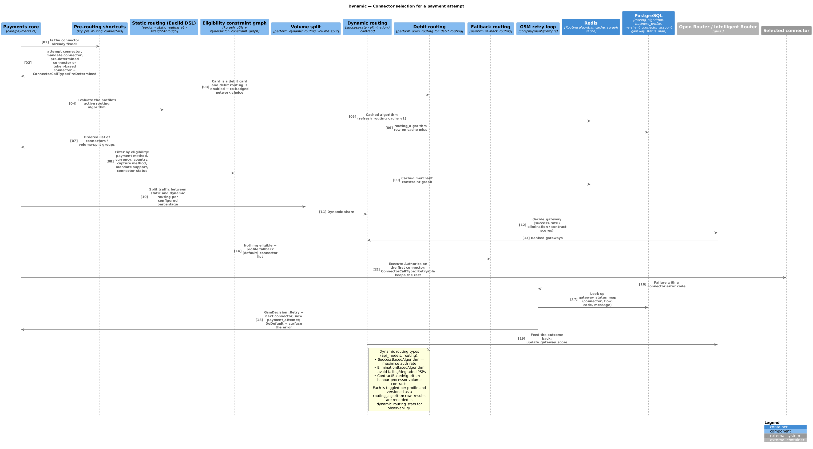

# 05 — Routing & decisioning

Code: `crates/router/src/core/routing/`, `crates/router/src/core/payments/routing.rs`,
`crates/router/src/core/debit_routing.rs`, `crates/router/src/core/conditional_config.rs`,
`crates/router/src/core/surcharge_decision_config.rs`,
`crates/router/src/core/three_ds_decision_rule.rs`, `crates/euclid`,
`crates/hyperswitch_constraint_graph`, `crates/kgraph_utils`,
`crates/api_models/src/routing.rs`.

Diagram: [connector selection dynamic view](diagrams/c4-dynamic-routing-decision.puml)
([PNG](diagrams/c4-dynamic-routing-decision.png)).



## Output of routing: `ConnectorCallType`

```rust
pub enum ConnectorCallType {
    PreDetermined(ConnectorRoutingData),      // connector already fixed
    Retryable(Vec<ConnectorRoutingData>),     // ordered list; head is tried, tail feeds retries
    SessionMultiple(SessionConnectorDatas),   // wallet session tokens from several connectors
    #[cfg(feature = "v2")] Skip,
}
```

`payment_attempt.routing_approach` records *why* a connector was chosen:
`RuleBasedRouting`, `VolumeBasedRouting`, `SuccessRateExploitation`,
`SuccessRateExploration`, `ContractBasedRouting`, `DebitRouting`,
`StraightThroughRouting`, `DefaultFallback`, or `Other(String)`.

## Decision order

1. **Pre-determined shortcuts** — a connector supplied on the request, a
   mandate/token-bound connector, or `straight_through_algorithm` stored on the attempt →
   `PreDetermined`.
2. **Decision manager (pre-routing decisions)** — 3DS vs no-3DS and exemption via the
   profile's `three_ds_decision_rule_algorithm`
   (`StaticRoutingAlgorithm::ThreeDsDecisionRule` programs), and surcharge/tax-on-surcharge
   via the surcharge decision config.
3. **Debit routing** — for co-badged debit cards with `is_debit_routing_enabled`, choose
   the least-cost network/acquirer combination (`core/debit_routing.rs`,
   `acquirer_config_map` on the profile).
4. **Static routing algorithm** — the profile's active `routing_algorithm` from
   `routing_algorithm` (cached in Redis):
   * `Single` — one connector.
   * `Priority` — ordered list.
   * `VolumeSplit` — percentage split across connectors.
   * `Advanced` — a Euclid DSL `Program<ConnectorSelection>`: rules of comparisons over
     payment attributes (amount, currency, country, payment method/type, card network,
     BIN, metadata, …) with a default selection. Compiled and evaluated by
     `crates/euclid` (also compiled to WASM in `crates/euclid_wasm` for the dashboard
     rule builder).
5. **Eligibility filtering (constraint graph)** — the candidate list is filtered by a
   compiled constraint graph (`crates/hyperswitch_constraint_graph` built from merchant
   connector accounts by `crates/kgraph_utils`): payment method and subtype support,
   currency, country, capture method, mandate/setup-future-usage support, connector
   `status`/`disabled`. The graph is cached per merchant and invalidated on connector
   account changes.
6. **Static vs dynamic split** — the profile's `dynamic_routing_algorithm` config decides
   what share of traffic is routed by the dynamic engines.
7. **Dynamic routing** (`DynamicRoutingAlgorithm`, per-profile toggles and versions):
   * `SuccessBasedAlgorithm` — rank connectors by recent success rate, with
     exploitation/exploration split and `SuccessRateSpecificityLevel` for how narrowly
     stats are bucketed.
   * `EliminationBasedAlgorithm` — temporarily eliminate connectors that are failing or
     degraded.
   * `ContractBasedAlgorithm` — respect processor volume contracts over a
     `ContractBasedTimeScale`.
   Scores can be computed in-process or delegated to the external **Open Router**
   decision engine; outcomes are written to `dynamic_routing_stats` and fed back with
   `update_gateway_score` after each attempt.
8. **Fallback** — if nothing is eligible, the profile's `default_fallback_routing` list is
   used (`DefaultFallback`).
9. **Execution & retries** — the head of the list is called; on failure
   `gateway_status_map` → `GsmDecision::Retry` moves to the next entry and creates a new
   `payment_attempt` (`core/payments/retry.rs`, `[feature: retry]`), bounded by
   `is_auto_retries_enabled` / `max_auto_retries_enabled`.

## Rule engine (Euclid DSL)

`crates/euclid` provides the AST (`frontend/ast.rs`), the VIR/DIR intermediate
representations, the interpreter backend (`backend/`), and the static-analysis module
(`dssa/`) that detects contradictory or unreachable rules before an algorithm is
activated. The same DSL powers connector selection, 3DS decision rules and surcharge
rules — only the output type differs (`ConnectorSelection`, `ThreeDSDecisionRule`,
surcharge details).

## Configuration surface

| Object | Where | Notes |
| --- | --- | --- |
| Routing algorithms | `routing_algorithm` table, `routes/routing.rs` | Created, listed, activated and retrieved per profile; versioned, immutable once created |
| Active algorithm | `business_profile.routing_algorithm` | Activated algorithm id |
| Dynamic routing config | `business_profile.dynamic_routing_algorithm` | Per-algorithm enable/disable + params (`DynamicRoutingFeatures`) |
| 3DS decision rules | `business_profile.three_ds_decision_rule_algorithm` | `routes/three_ds_decision_rule.rs` |
| Fallback | `business_profile.default_fallback_routing` | Ordered connector list |
| Debit routing | `business_profile.is_debit_routing_enabled`, `acquirer_config_map` | |
| Retry policy | `business_profile.is_auto_retries_enabled`, `max_auto_retries_enabled`, `is_manual_retry_enabled`, `is_clear_pan_retries_enabled` | |
| Error → decision mapping | `gateway_status_map` table, `routes/gsm.rs` | `GsmDecision` per (connector, flow, status, code, message) |

## Payouts

Payout routing mirrors payment routing (`payout_routing_algorithm` on merchant/profile,
`core/payouts/`) with payout-specific eligibility and `[feature: payout_retry]`.
