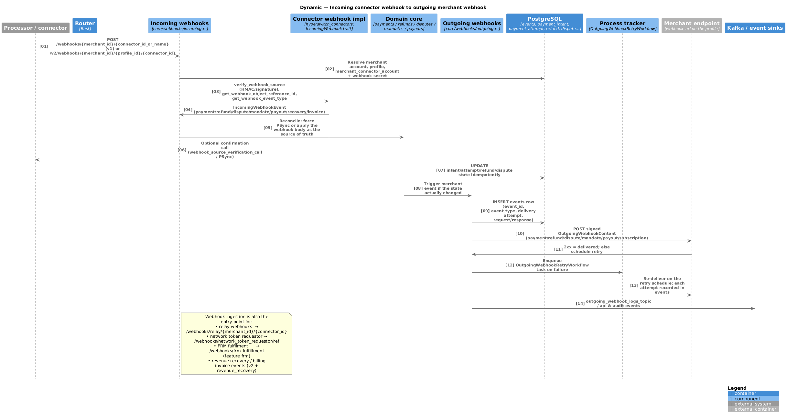

# 07 — Webhooks, events & the scheduler

Code: `crates/router/src/core/webhooks/` (`incoming.rs`, `outgoing.rs`),
`crates/router/src/routes/webhooks.rs`, `crates/router/src/routes/webhook_events.rs`,
`crates/scheduler`, `crates/router/src/workflows/`, `crates/drainer`, `crates/events`.

Diagram: [incoming → outgoing webhook](diagrams/c4-dynamic-incoming-webhook.puml)
([PNG](diagrams/c4-dynamic-incoming-webhook.png)); scheduler internals in the
[L3 component view](diagrams/c4-l3-component-scheduler-drainer.puml)
([PNG](diagrams/c4-l3-component-scheduler-drainer.png)).



## Incoming connector webhooks

Endpoints (`routes/app.rs`):

```
POST /webhooks/{merchant_id}/{connector_id_or_name}          # v1
POST /v2/webhooks/{merchant_id}/{profile_id}/{connector_id}   # v2
POST /webhooks/relay/{merchant_id}/{connector_id}             # relay objects
POST /webhooks/network_token_requestor/ref                    # network token requestor
POST /webhooks/frm_fulfillment                                # FRM fulfilment [feature: frm]
     recovery / invoice webhook routes                        # [feature: revenue_recovery]
```

Processing (`core/webhooks/incoming.rs`):

1. Resolve merchant account, profile and merchant connector account (webhook secret
   included) from the path.
2. `verify_webhook_source` — connector-specific HMAC/signature verification. If the source
   cannot be trusted, the body is treated as a *hint* only.
3. `get_webhook_event_type` → `IncomingWebhookEvent`, `get_webhook_object_reference_id` →
   the Hyperswitch object (payment/refund/dispute/mandate/payout/invoice).
4. Reconcile: either force a PSync/RSync against the connector (the default when the
   payload is not authenticated) or apply the payload as the source of truth. All updates
   are idempotent — a repeated webhook does not re-transition a terminal object.
5. Persist the state change and, only if the state actually changed, trigger the
   corresponding merchant event.
6. Optionally answer the connector with a verification response
   (`webhook_source_verification_call`, endpoint-verification events).

`IncomingWebhookEvent` (`crates/api_models/src/webhooks.rs`) covers payment
success/failure/processing/capture/expiry/action-required, refunds, all dispute stages,
mandate activation/revocation, payouts, sourceverification/endpoint verification,
external authentication, FRM approval/rejection, and recovery/invoice events.

## Outgoing merchant webhooks

* Triggered from `core/webhooks/outgoing.rs` after a state change.
* Payload is an `OutgoingWebhookContent` variant — `PaymentDetails`, `RefundDetails`,
  `DisputeDetails`, `MandateDetails`, `PayoutDetails`, subscription/invoice details —
  wrapped with the `EventType` (32 variants) and the object id.
* Destination: `business_profile.webhook_details` (URL, custom HTTP headers via
  `outgoing_webhook_custom_http_headers`); signed with the merchant's
  `payment_response_hash_key` when `enable_payment_response_hash` is set.
* Every delivery attempt is persisted as an `events` row: `event_id`,
  `idempotent_event_id`, `initial_attempt_id`, `delivery_attempt`, `request`, `response`,
  `is_webhook_notified`, `is_overall_delivery_successful`.
* Non-2xx responses schedule an `OutgoingWebhookRetryWorkflow` task in `process_tracker`;
  the retry schedule is config-driven and each retry appends a new `events` row linked to
  the initial attempt.
* `routes/webhook_events.rs` exposes delivery listing/inspection and manual re-delivery.

## Process tracker & scheduler

`process_tracker` rows describe deferred work: `name`, `runner` (`ProcessTrackerRunner`),
`tracking_data` (JSON), `schedule_time`, `retry_count`, `status`, `business_status`, `tag`.

**Producer** (`SCHEDULER_FLOW=producer`, `crates/scheduler/src/producer.rs`)

* Loops every `producer.loop_interval` ms.
* Takes a Redis lock (`producer.lock_key`, `lock_ttl`) so only one producer batches.
* Selects tasks with `schedule_time` inside
  `[now - lower_fetch_limit, now + upper_fetch_limit]` that are not finished.
* Groups them into `ProcessTrackerBatch`es of `producer.batch_size` and `XADD`s each batch
  to the tenant's stream (`[scheduler] stream = "SCHEDULER_STREAM"`).

**Consumer** (`SCHEDULER_FLOW=consumer`, `crates/scheduler/src/consumer.rs`)

* Reads batches via the consumer group `SCHEDULER_GROUP`, can be switched off with
  `scheduler.consumer.disabled`, and shuts down gracefully on SIGTERM/SIGINT.
* Dispatches each task by `runner` to a `ProcessTrackerWorkflow` implementation
  (`crates/router/src/workflows/`), then marks it finished, retries it with a new
  `schedule_time`, or schedules the next occurrence.

Runners (17, `ProcessTrackerRunner`): `PaymentsSyncWorkflow`,
`PaymentsPostCaptureVoidSyncWorkflow`, `RefundWorkflowRouter`,
`DeleteTokenizeDataWorkflow`, `ApiKeyExpiryWorkflow`, `OutgoingWebhookRetryWorkflow`,
`AttachPayoutAccountWorkflow`, `PaymentMethodStatusUpdateWorkflow`,
`PaymentMethodModularForwardCompatWorkflow`, `PaymentMethodModularBackwardCompatWorkflow`,
`PassiveRecoveryWorkflow`, `ProcessDisputeWorkflow`, `DisputeListWorkflow`,
`InvoiceSyncflow`, `PayoutSyncWorkFlow`, `BatchBlocklistUpload`,
`NetworkTokenizationWorkflow`.

`routes/process_tracker.rs` exposes administrative retrieval/retry/revoke of tasks.

## Drainer (KV mode)

For merchants on `MerchantStorageScheme::RedisKv` the Router writes the entity to a Redis
hash and appends the operation to a partitioned stream (`stream_name = "DRAINER_STREAM"`,
`num_partitions = 64`). The drainer loops every `loop_interval` ms, reads up to
`max_read_count` entries per partition, applies the inserts/updates to PostgreSQL in
order, then trims the stream. Redis is therefore the write-ahead log and PostgreSQL the
eventually-consistent system of record; `reverse_lookup` rows keep secondary-id lookups
working while data is still only in Redis.

## Event streaming & analytics

`crates/events` defines the event sinks (logger and Kafka). Published streams include
payment intents, payment attempts, refunds, disputes, payouts, audit events, API request
events, connector API logs, outgoing webhook logs and routing/dynamic-routing events
(topic names under `[events.kafka]` in `config/*.toml`). Vector or a similar shipper moves
Kafka topics into ClickHouse (analytics) and OpenSearch (global search); see
[10 — Deployment & operations](10-deployment-and-operations.md).
