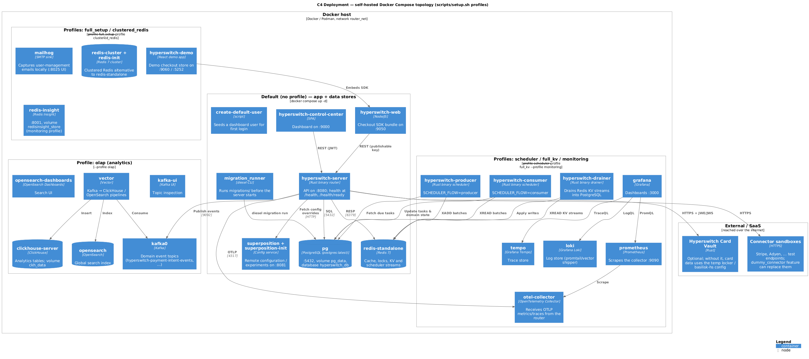

# 10 — Deployment & operations

Diagram: [Docker Compose deployment](diagrams/c4-deployment-docker-compose.puml)
([PNG](diagrams/c4-deployment-docker-compose.png) ·
[SVG](diagrams/c4-deployment-docker-compose.svg)).

## Deployable components

| Binary | Crate / entrypoint | Role | Scaling |
| --- | --- | --- | --- |
| `router` (`hyperswitch-server`) | `crates/router/src/bin/router.rs` | HTTP API, webhook ingestion, connector calls, routing | Stateless; scale horizontally behind a load balancer |
| `scheduler` (producer) | `crates/router/src/bin/scheduler.rs`, `SCHEDULER_FLOW=producer` | Batches due `process_tracker` tasks into Redis streams | Run ≥1; Redis lock (`producer.lock_key`) makes extra instances passive |
| `scheduler` (consumer) | same binary, `SCHEDULER_FLOW=consumer` | Executes workflows from the stream | Scale horizontally (consumer group) |
| `drainer` | `crates/drainer` | Applies Redis KV streams to PostgreSQL (RedisKv merchants) | Scale up to `num_partitions` (default 64) |
| `migration_runner` | `docker/migration-runner.Dockerfile`, `migrations/` | Runs Diesel migrations before the server starts | One-shot |
| Web SDK / Control Center / demo app | separate repos, images in `docker-compose.yml` | Checkout SDK, dashboard, demo store | Static hosting |

Backing services: PostgreSQL (master + optional replica, plus optional separate
`accounts_database` / `global_database`), Redis (standalone or cluster), Kafka, ClickHouse,
OpenSearch, the Card Vault/locker, the key manager, and optionally Superposition (remote
config), the Unified Connector Service and Open Router.

## Local / demo topology (`docker-compose.yml`)

Compose profiles let you bring up only what you need:

| Profile | Services |
| --- | --- |
| *(default)* | `pg`, `redis-standalone`, `migration_runner`, `hyperswitch-server`, `hyperswitch-control-center`, `hyperswitch-web`, `superposition` (+ init), `create-default-user` |
| `scheduler` | `hyperswitch-producer`, `hyperswitch-consumer` |
| `full_kv` | scheduler services + `hyperswitch-drainer` |
| `olap` | `kafka0`, `kafka-ui`, `clickhouse-server`, `vector`, `opensearch`, `opensearch-dashboards` |
| `monitoring` | `otel-collector`, `prometheus`, `tempo`, `loki`, `promtail`/`vector`, `grafana`, `redis-insight` |
| `full_setup` | monitoring + olap + `mailhog`, `hyperswitch-demo` |
| `clustered_redis` | `redis-cluster` + `redis-init` instead of `redis-standalone` |

Default ports: router `8080`, Control Center `9000`, SDK `9050`, demo app `9060`,
Superposition `8081`, Grafana `3000`, Kafka UI `8090`, OpenSearch Dashboards `5601`,
Redis Insight `8001`, MailHog UI `8025`.

Other deployment paths in the repo: `docker-compose-development.yml` (build from source),
`monitoring/docker-compose.yaml` and `monitoring/docker-compose-ckh.yaml` (standalone
observability/analytics stacks), `loadtest/` (k6 + compose harness), `flake.nix`/`nix/`
for a reproducible dev shell.

## Configuration model

Layered, later layers overriding earlier ones:

1. `config/development.toml` / `config/docker_compose.toml` /
   `config/deployments/{integration_test,sandbox,production}.toml` — the base file chosen
   per environment.
2. `config/deployments/env_specific.toml` — sensitive, environment-specific values.
3. Environment variables (`ROUTER__SERVER__PORT`-style double-underscore paths;
   `SCHEDULER_FLOW`, `RUN_ENV`).
4. Secrets managers (AWS KMS/Secrets Manager, HashiCorp Vault) resolved at boot via
   `[secrets]` and `crates/external_services`.
5. Superposition remote config for runtime experiment/config overrides.

Key sections: `[server]`, `[server.tls]`, `[master_database]` / `[replica_database]` /
`[accounts_database]` / `[global_database]`, `[redis]`, `[locker]`, `[jwekey]`,
`[key_manager]`, `[scheduler]` (+ `.producer`, `.consumer`, `.server`), `[drainer]`,
`[events.kafka]`, `[analytics]`, `[log.*]`, `[connectors.*]`, `[pm_filters.*]`,
`[mandates.*]`, `[payouts]`, `[multitenancy.*]`, `[cors]`, `[email]`, `[user]`, `[oidc.*]`,
`[api_keys]`, `[eph_key]`, `[webhooks]`, `[dummy_connector]`, `[debit_routing_config]`,
`[tokenization]`, `[open_router]`, `[superposition]`,
`[grpc_client.{dynamic_routing_client,recovery_decider_client,unified_connector_service}]`.

Cargo features decide what is compiled in (`crates/router/Cargo.toml`): `v1` / `v2`
(mutually exclusive), `olap`, `oltp`, `kv_store`, `accounts_cache`, `payouts`,
`payout_retry`, `retry`, `frm`, `revenue_recovery`, `tokenization_v2`, `dynamic_routing`,
`encryption_service`, `keymanager_create`, `keymanager_mtls`, `km_forward_x_request_id`,
`dummy_connector`, `external_access_dc`, `email`, `tls`, `partial-auth`, `stripe`, `deja`,
`ext_services_latency`, `fred` / `redis-rs`, `release`.

## Database & migrations

* `migrations/` — v1 Diesel migrations, applied by `migration_runner` /
  `diesel migration run` (`diesel.toml`).
* `v2_migrations/` + `v2_compatible_migrations/` and `diesel_v2.toml` — the v2 schema and
  the intermediate schema that can serve both generations during migration.
* Schemas are checked in as `crates/diesel_models/src/schema.rs` (51 tables) and
  `schema_v2.rs` (52 tables); they are generated from the database, not hand-edited.
* Reads can be directed at `[replica_database]`; analytics reads go to ClickHouse.

## Observability

* **Metrics** — OpenTelemetry from the Router/scheduler/drainer to the OTEL collector →
  Prometheus (`config/otel-collector.yaml`, `config/prometheus.yaml`). Instrumented areas
  include HTTP request/response counts and latency, connector API latency and errors,
  cache hit/miss, KV vs SQL operations, scheduler task counts and lag, and drainer stream
  depth.
* **Traces** — OTLP spans to Tempo (`config/tempo.yaml`); every request carries a request
  id and log span.
* **Logs** — structured JSON with masked PII, shipped by promtail/vector/fluentd to Loki
  (`config/loki.yaml`, `config/promtail.yaml`, `config/vector.yaml`, `docker/fluentd`).
* **Dashboards** — Grafana provisioned via `config/grafana.ini` and
  `config/grafana-datasource.yaml`.
* **Analytics/search** — Kafka topics → ClickHouse (payment/refund/dispute/audit/API/
  webhook events) and OpenSearch for global search; the `olap`-gated analytics APIs read
  from these.
* **Health** — `GET /health` (liveness) and `GET /health/ready` (checks database, Redis,
  locker, analytics and outgoing-request reachability).

## Runbook notes

* **Stuck payments** — `PaymentsSyncWorkflow` tasks in `process_tracker`; inspect/retry via
  the process-tracker admin routes, or force a `GET /payments/{id}?force_sync=true`.
* **Webhook delivery failures** — inspect `events` rows via `/events/{merchant_id}` and
  re-deliver; retries are driven by `OutgoingWebhookRetryWorkflow`.
* **KV lag** — watch drainer stream depth; a stalled drainer means PostgreSQL is behind
  Redis, so reporting/analytics lag while OLTP still works.
* **Config/account changes not taking effect** — account, connector, routing and
  constraint-graph caches are Redis-backed; use the cache-invalidation admin routes.
* **Connector incidents** — deactivate the merchant connector account, adjust routing
  (fallback/priority) or add `gateway_status_map` entries to change retry behaviour; both
  take effect after cache invalidation without a deploy.
* **Scheduler down** — the Router keeps accepting payments; deferred work (syncs, webhook
  retries, recovery) simply queues in `process_tracker` until the producer/consumer return.
